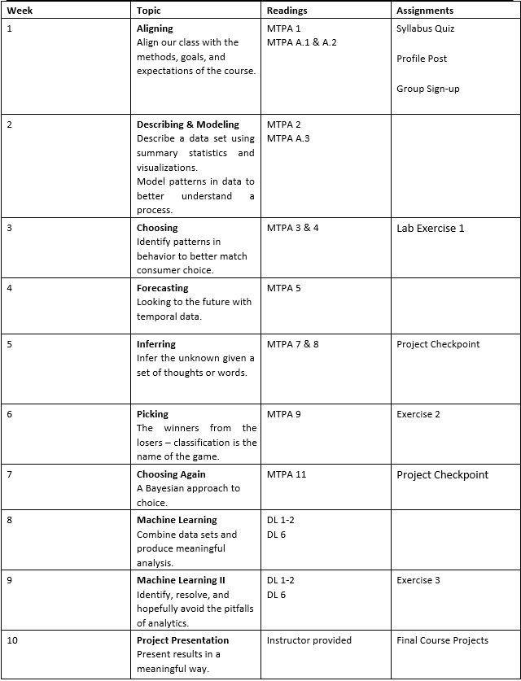

## Ryan Timbrook (Graduate Student - Course Work Repository)

## [Syracuse University, Masters of Applied Data Science](https://ischool.syr.edu/academics/graduate/masters-degrees/ms-in-applied-data-science/)

### IST 718 BIG DATA ANALYTICS - Summar 2019
### SYLLABUS

                                   **SYRACUSE UNIVERSITY School of Information Studies**
                                           **IST - 718 BIG DATA ANALYTICS**     

Prerequisite / Co-requisite:  IST 687:  Introduction to Data Science - additional course description below. 
 
Audience: Graduate online only. 
 
Description: A broad introduction to analytical processing tools and techniques for information professionals.  Students will develop a portfolio of resources, demonstrations, recipes, and examples of various analytical techniques.    
 
Additional Course Description:  You will find if much easier to succeed if you have completed IST687, IST777 or both.  Familiarity with command-line interfaces, basic quantitative skills, including statistics, as well as programming skills with languages such as R or Python.  Most of the course work will be using Python, Spark, and Tensorflow. 

Learning Objectives: During the course, we will emphasize:  1. Experiential learning through reading and practical exercises.  2. Collaborative learning through online discussions between instructors and peers.  3. Self-learning with appropriate instructional support and timely feedback using analytical case studies.  
In order to be successful in this course, the student will:  1. Pro-actively research solution options vs. relying solely on textbook content.  2. Actively code while completing the reading assignments.  3. Present results in a professional manner.  Comments – Clarity – Correctness – Credit.   4. Submit their assignments on time.  
After taking this course, the students will be able to: 1. Obtain data and explain data structures and data elements.  
2. Scrub data by applying scripting methods, to include debugging, for data manipulation in Python, R or other languages.  3. Explore data by analyzing using qualitative techniques including descriptive statistics, summarization, and visualizations.  

Model relationships between data using the appropriate analytical methodologies matched to the information and the needs of clients and users.  5. INterpret the data, model, analysis, and findings.  Communicate the results in a meaningful way.  6. Select an applicable analytical methodology for real problems in areas such as business, science, and engineering.  
Bibliography/ Texts / Supplies: Required:  
 
Miller, Thomas W., Modeling Techniques in Predictive Analytics with Python and R, Pearson, 2015. 
 
Goodfellow, Ian, Yoshua Bengio, and Aaron Courville, Deep Learning (DL), MIT Press, 2016.  Available at http://www.deeplearningbook.org/. 
 
Additional: 
 
James, Gareth, Daniela Witten, Trevor Hastie, and Robert Tibshirani, An Introduction to Statistical Learning with Applications in R, Springer, 2013.  Available at https://wwwbcf.usc.edu/~gareth/ISL/ISLR%20First%20Printing.pdf.  

Assignment #1:  Laboratory Exercises  Laboratory exercises provide open-ended problem-solving experiences that build on the material covered in the readings.  The laboratory exercises facilitate the learning objectives of the course by providing the opportunity to apply techniques from class to realistic problem-solving situations.  The instructor will provide a separate laboratory instruction document for each assignment.  There are 3 laboratory exercises in this course worth a maximum of 12 points each.  Maximum points are possible if the submission is on-time, complete, and correct.  
 
Assignment #2:  Course Participation  Data science is a young and fast moving professional field built on foundations of mathematics and computer science.  The asynchronous materials provide multiple engagement opportunities each week.  Each week will provide questions and activities designed to evaluate comprehension of fundamental analytical principles.  Maximum points are possible if the student completes the asynchronous questions and activities prior to the weekly group discussion.   
 
Assignment #3:  Final Project  For the final project, students will identify a data-focused problem, bring together different data sources, conduct analysis, draw conclusions, and produce a report explaining the results.  Maximum points are possible if the submission is on-time, complete, and demonstrates the student’s ability to select the appropriate analytical methods to the chosen problem; interpret the data, model, analysis, findings; draw appropriate conclusions; and present the results in a meaningful way.  
 
Assignment #4: Group Discussions The weekly group discussion provides an opportunity for students to engage the instructor and the class while demonstrating understanding of facts and ideas from the asynchronous session.  Each week will provide a case / reading material focused on a select topic, methodology, or business application.  Maximum points are possible if the student is present, prepared, and engaged during the weekly group discussion.   

Course Schedule:

[SYRACUSE UNIVERSITY School of Information Studies](https://ischool.syr.edu/)
